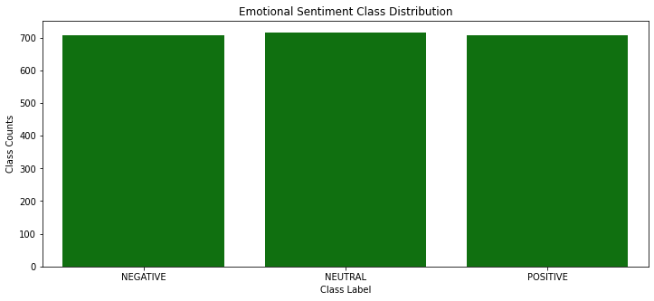
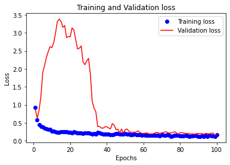
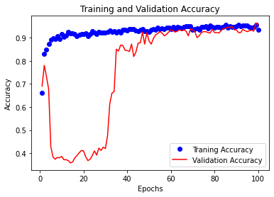

```python
import pandas as pd
import numpy as np
import keras
from keras import models
from keras import layers
from keras import optimizers
from sklearn.model_selection import train_test_split
from keras.utils import to_categorical
import matplotlib.pyplot as plt
import seaborn as sns

import warnings
warnings.filterwarnings('ignore')
```

# Introduction
Recently, 1D convolutional neural network (CNN), typically used with dilated kernels, have been used with great success for audio generation and machine translation. In addition to these successes, it has long been known that small 1D convnets can offer a fast alternative to RNNs for simple tasks such as text classification and timeseries forecasting.
In this notebook, we will see how to classify time series data using 1D convnets and how to best avoid overfitting as well as ways in which hyperparameters can be tuned to improve the model's accuracy. This mini project follows two main steps: first is the data preparation to turn the dataset into an accepted form we can ingest in the model. Second is the model building and tuning to improve accuracy.
It is worth noting that classical machine learning methods could be used for time series data but would require hand crafting features using feature engineering. Deep learning methods such as Recurrent neural nets or convolutional neural nets have shown tp provide state-of-the-art results on challenging activity recognition tasks with little or no feature engineering used.
Below, I load the dataset and provide a snapshot of what I will be working with.

## Dataset Description
The Electroencephalography (EEG) dataset contains electronic brainwave signals from a EEG headset and is in temporal (timeseries) format. The main question of this study is: can we predict emotional sentiment from brainwave readings? Brainwave readings are classified into three categories: Negative, Positive and Neutral emotions.


```python
# data importation
df_emotion = pd.read_csv('Data/emotions.csv')
print(df_emotion.shape)
df_emotion.head()
```

    (2132, 2549)


<div>
<style scoped>
    .dataframe tbody tr th:only-of-type {
        vertical-align: middle;
    }

    .dataframe tbody tr th {
        vertical-align: top;
    }

    .dataframe thead th {
        text-align: right;
    }
</style>
<table border="1" class="dataframe">
  <thead>
    <tr style="text-align: right;">
      <th></th>
      <th># mean_0_a</th>
      <th>mean_1_a</th>
      <th>mean_2_a</th>
      <th>mean_3_a</th>
      <th>mean_4_a</th>
      <th>mean_d_0_a</th>
      <th>mean_d_1_a</th>
      <th>mean_d_2_a</th>
      <th>mean_d_3_a</th>
      <th>mean_d_4_a</th>
      <th>...</th>
      <th>fft_741_b</th>
      <th>fft_742_b</th>
      <th>fft_743_b</th>
      <th>fft_744_b</th>
      <th>fft_745_b</th>
      <th>fft_746_b</th>
      <th>fft_747_b</th>
      <th>fft_748_b</th>
      <th>fft_749_b</th>
      <th>label</th>
    </tr>
  </thead>
  <tbody>
    <tr>
      <th>0</th>
      <td>4.62</td>
      <td>30.3</td>
      <td>-356.0</td>
      <td>15.6</td>
      <td>26.3</td>
      <td>1.070</td>
      <td>0.411</td>
      <td>-15.70</td>
      <td>2.06</td>
      <td>3.15</td>
      <td>...</td>
      <td>23.5</td>
      <td>20.3</td>
      <td>20.3</td>
      <td>23.5</td>
      <td>-215.0</td>
      <td>280.00</td>
      <td>-162.00</td>
      <td>-162.00</td>
      <td>280.00</td>
      <td>NEGATIVE</td>
    </tr>
    <tr>
      <th>1</th>
      <td>28.80</td>
      <td>33.1</td>
      <td>32.0</td>
      <td>25.8</td>
      <td>22.8</td>
      <td>6.550</td>
      <td>1.680</td>
      <td>2.88</td>
      <td>3.83</td>
      <td>-4.82</td>
      <td>...</td>
      <td>-23.3</td>
      <td>-21.8</td>
      <td>-21.8</td>
      <td>-23.3</td>
      <td>182.0</td>
      <td>2.57</td>
      <td>-31.60</td>
      <td>-31.60</td>
      <td>2.57</td>
      <td>NEUTRAL</td>
    </tr>
    <tr>
      <th>2</th>
      <td>8.90</td>
      <td>29.4</td>
      <td>-416.0</td>
      <td>16.7</td>
      <td>23.7</td>
      <td>79.900</td>
      <td>3.360</td>
      <td>90.20</td>
      <td>89.90</td>
      <td>2.03</td>
      <td>...</td>
      <td>462.0</td>
      <td>-233.0</td>
      <td>-233.0</td>
      <td>462.0</td>
      <td>-267.0</td>
      <td>281.00</td>
      <td>-148.00</td>
      <td>-148.00</td>
      <td>281.00</td>
      <td>POSITIVE</td>
    </tr>
    <tr>
      <th>3</th>
      <td>14.90</td>
      <td>31.6</td>
      <td>-143.0</td>
      <td>19.8</td>
      <td>24.3</td>
      <td>-0.584</td>
      <td>-0.284</td>
      <td>8.82</td>
      <td>2.30</td>
      <td>-1.97</td>
      <td>...</td>
      <td>299.0</td>
      <td>-243.0</td>
      <td>-243.0</td>
      <td>299.0</td>
      <td>132.0</td>
      <td>-12.40</td>
      <td>9.53</td>
      <td>9.53</td>
      <td>-12.40</td>
      <td>POSITIVE</td>
    </tr>
    <tr>
      <th>4</th>
      <td>28.30</td>
      <td>31.3</td>
      <td>45.2</td>
      <td>27.3</td>
      <td>24.5</td>
      <td>34.800</td>
      <td>-5.790</td>
      <td>3.06</td>
      <td>41.40</td>
      <td>5.52</td>
      <td>...</td>
      <td>12.0</td>
      <td>38.1</td>
      <td>38.1</td>
      <td>12.0</td>
      <td>119.0</td>
      <td>-17.60</td>
      <td>23.90</td>
      <td>23.90</td>
      <td>-17.60</td>
      <td>NEUTRAL</td>
    </tr>
  </tbody>
</table>
<p>5 rows × 2549 columns</p>
</div>


Below, we visualize a barplot depicting the share of each response category in the dataset. There is equal distribution of labels, meaning that we will not need any statistical techniques suchs oversampling or undersampling to deal with imbalanceness in the labels.


```python
plt.figure(figsize=(12,5))
sns.countplot(df_emotion.label, color='g')
plt.xlabel("Class Label")
plt.ylabel("Class Counts")
plt.title("Emotional Sentiment Class Distribution")
```


    Text(0.5, 1.0, 'Emotional Sentiment Class Distribution')





## Preprocessing the Data
This process involves redefining the labels since they cannot remain as strings, one-hot encoding the labels, turning the whole dataset into an array using numpy, splitting the data into training and testing sets, normalizing the data (it would be problematic to feed into the neural network values that all take widely different ranges), and finally reshaping the input data. In the following code chunk, I will assign labels values from 0 to 2 to help during the one-hot encoding process.


```python
# categorizing the labels
df_emotion.loc[df_emotion['label'] == 'POSITIVE', 'label'] = 0
df_emotion.loc[df_emotion['label'] == 'NEGATIVE', 'label'] = 1
df_emotion.loc[df_emotion['label'] == 'NEUTRAL', 'label'] = 2

# defining features as x and label as y
x = df_emotion.iloc[:,:-1] # selecting oth column to n-1th column
y = df_emotion.iloc[:,-1] # selecting the 'label' column
# preparing the labels: one-hot encoding array
y = to_categorical(y)
print(y)
# changing the input data into an array
x = np.array(x[:])
print(x)
```

    [[0. 1. 0.]
     [0. 0. 1.]
     [1. 0. 0.]
     ...
     [0. 1. 0.]
     [0. 1. 0.]
     [0. 0. 1.]]
    [[ 4.62e+00  3.03e+01 -3.56e+02 ... -1.62e+02 -1.62e+02  2.80e+02]
     [ 2.88e+01  3.31e+01  3.20e+01 ... -3.16e+01 -3.16e+01  2.57e+00]
     [ 8.90e+00  2.94e+01 -4.16e+02 ... -1.48e+02 -1.48e+02  2.81e+02]
     ...
     [-5.47e-01  2.83e+01 -2.59e+02 ... -1.05e+01 -1.05e+01 -1.69e+02]
     [ 1.68e+01  1.99e+01 -2.88e+02 ... -2.71e+02 -2.71e+02  5.52e+02]
     [ 2.70e+01  3.20e+01  3.18e+01 ...  2.28e+01  2.28e+01 -6.71e+00]]


Below, I split the input data and labels into training data, training label, testing data, testing label. Note that 20% of the input data was used as testing for the model validation step whereas 80% of the input data was used as training.


```python
# splitting the dataset into training and testing plus respective labels
X_train, X_test, y_train, y_test = train_test_split(x, y, test_size=0.2, random_state=200)
```

During normalization (see below), for each feature in the input data, I substracted the mean of the feature and divided by the standard deviation so that the feature is centered around 0 and has a unit standard deviation.


```python
# normalizing the dataset: i also could use StandardScalar from preprocessing
## substracting the mean with respect to each column
mean = X_train.mean(axis=0)
X_train -= mean
## dividing by the standard deviation
std = X_train.std(axis=0)
X_train /= std
## doing the same for test dataset but making sure I normalize using training dataset
X_test -= mean
X_test /= std
```

In keras, the 1D convnet layer takes as input a 3D array with shape (samples, timesteps, features) and returns a similarly shaped 3D array. 


```python
# reshape from [samples, timesteps] into [samples, timesteps, features]
X_train = X_train.reshape(X_train.shape[0], X_train.shape[1], 1)
X_test = X_test.reshape(X_test.shape[0], X_test.shape[1], 1)
print(X_train.shape)
print(X_test.shape)

# validating the approach by splitting the training dataset
x_val = X_train[:500] # validation data is 500 long
partial_x_train = X_train[500:]

y_val = y_train[:500] # validation label is 500 long
partial_y_train = y_train[500:]
```

    (1705, 2548, 1)
    (427, 2548, 1)


# Model Building and Validating
## 1D convolution for sequence data
In the same way that 2D convolutions work, 1D convolutions work by extracting local 1D patches (subsequences) from sequences. It does so by recognizing local patterns in a sequence. Because the same input transformation is performed on every patch, a pattern learned at a certain position in a sequence can later be recognized at a different position, making 1D convnets **translation invariant (for temporal translations)**.

## 1D pooling for sequence data
The pooling layer works by extracting 1D patches (subsequences) from an input and outputting the maximum value (max pooling) or average value (average pooling) to reduce the length of the output of the convolutional layer to the most salient elements.

The convolutional and pooling layers are followed by a dense fully connected layer that interprets the features extracted by the convolutional part of the model. A flatten layer is used between the convolutional layers and the dense layer to reduce the feature maps to a single one-dimensional vector.


```python
n_features = 1
# model definition
model = models.Sequential()
model.add(layers.Conv1D(128, kernel_size=3, activation='relu', input_shape=(X_train.shape[1],n_features)))
model.add(layers.BatchNormalization())
model.add(layers.MaxPooling1D(pool_size=(2)))
model.add(layers.Conv1D(128, kernel_size=3, activation='relu'))
model.add(layers.BatchNormalization())
model.add(layers.MaxPooling1D(pool_size=(2)))
model.add(layers.Flatten()) # reducing the output into 1D vector
model.add(layers.Dense(64, activation='tanh'))
model.add(layers.Dropout(0.2)) # preventing overfitting
model.add(layers.Dense(32, activation='tanh'))
model.add(layers.Dropout(0.2))
model.add(layers.Dense(16, activation='relu'))
model.add(layers.Dropout(0.2))
model.add(layers.Dense(3, activation='softmax')) # label categorized in 3 classes
model.summary()
```

    Model: "sequential_3"
    _________________________________________________________________
    Layer (type)                 Output Shape              Param #   
    =================================================================
    conv1d_5 (Conv1D)            (None, 2546, 128)         512       
    _________________________________________________________________
    batch_normalization_5 (Batch (None, 2546, 128)         512       
    _________________________________________________________________
    max_pooling1d_5 (MaxPooling1 (None, 1273, 128)         0         
    _________________________________________________________________
    conv1d_6 (Conv1D)            (None, 1271, 128)         49280     
    _________________________________________________________________
    batch_normalization_6 (Batch (None, 1271, 128)         512       
    _________________________________________________________________
    max_pooling1d_6 (MaxPooling1 (None, 635, 128)          0         
    _________________________________________________________________
    flatten_3 (Flatten)          (None, 81280)             0         
    _________________________________________________________________
    dense_9 (Dense)              (None, 64)                5201984   
    _________________________________________________________________
    dropout_7 (Dropout)          (None, 64)                0         
    _________________________________________________________________
    dense_10 (Dense)             (None, 32)                2080      
    _________________________________________________________________
    dropout_8 (Dropout)          (None, 32)                0         
    _________________________________________________________________
    dense_11 (Dense)             (None, 16)                528       
    _________________________________________________________________
    dropout_9 (Dropout)          (None, 16)                0         
    _________________________________________________________________
    dense_12 (Dense)             (None, 3)                 51        
    =================================================================
    Total params: 5,255,459
    Trainable params: 5,254,947
    Non-trainable params: 512
    _________________________________________________________________


```python
# Compiling the model
model.compile(optimizer='adam', # for updating the weights
              loss=keras.losses.categorical_crossentropy, # multiclass classification problem
              metrics=['accuracy']) # validation metric
```


```python
# Model Training and validating
history = model.fit(partial_x_train, partial_y_train,
         batch_size = 128,
         epochs = 100,
         validation_data=(x_val, y_val))
```

    Train on 1205 samples, validate on 500 samples
    Epoch 1/100
    1205/1205 [==============================] - 174s 145ms/step - loss: 0.9228 - accuracy: 0.6614 - val_loss: 0.8589 - val_accuracy: 0.6900
    Epoch 2/100
    1205/1205 [==============================] - 132s 109ms/step - loss: 0.5809 - accuracy: 0.8290 - val_loss: 0.6287 - val_accuracy: 0.7800
    Epoch 3/100
    1205/1205 [==============================] - 137s 113ms/step - loss: 0.4562 - accuracy: 0.8473 - val_loss: 0.8489 - val_accuracy: 0.7320
    Epoch 4/100
    1205/1205 [==============================] - 133s 111ms/step - loss: 0.4062 - accuracy: 0.8714 - val_loss: 1.2283 - val_accuracy: 0.6780
    Epoch 5/100
    1205/1205 [==============================] - 132s 110ms/step - loss: 0.3829 - accuracy: 0.8905 - val_loss: 1.8942 - val_accuracy: 0.4280
    Epoch 6/100
    1205/1205 [==============================] - 129s 107ms/step - loss: 0.3496 - accuracy: 0.8971 - val_loss: 2.0941 - val_accuracy: 0.3840
    Epoch 7/100
    1205/1205 [==============================] - 138s 114ms/step - loss: 0.3383 - accuracy: 0.8929 - val_loss: 2.3138 - val_accuracy: 0.3740
    Epoch 8/100
    1205/1205 [==============================] - 133s 111ms/step - loss: 0.3141 - accuracy: 0.9054 - val_loss: 2.4796 - val_accuracy: 0.3820
    Epoch 9/100
    1205/1205 [==============================] - 130s 108ms/step - loss: 0.3150 - accuracy: 0.8929 - val_loss: 2.6179 - val_accuracy: 0.3800
    Epoch 10/100
    1205/1205 [==============================] - 133s 110ms/step - loss: 0.2674 - accuracy: 0.9154 - val_loss: 2.5874 - val_accuracy: 0.3860
    Epoch 11/100
    1205/1205 [==============================] - 143s 118ms/step - loss: 0.2727 - accuracy: 0.9037 - val_loss: 2.7277 - val_accuracy: 0.3720
    Epoch 12/100
    1205/1205 [==============================] - 139s 115ms/step - loss: 0.2547 - accuracy: 0.9087 - val_loss: 2.9936 - val_accuracy: 0.3720
    Epoch 13/100
    1205/1205 [==============================] - 134s 111ms/step - loss: 0.2292 - accuracy: 0.9261 - val_loss: 3.3181 - val_accuracy: 0.3680
    Epoch 14/100
    1205/1205 [==============================] - 130s 108ms/step - loss: 0.2347 - accuracy: 0.9187 - val_loss: 3.3799 - val_accuracy: 0.3580
    Epoch 15/100
    1205/1205 [==============================] - 130s 108ms/step - loss: 0.2519 - accuracy: 0.9178 - val_loss: 3.3174 - val_accuracy: 0.3620
    Epoch 16/100
    1205/1205 [==============================] - 131s 109ms/step - loss: 0.2515 - accuracy: 0.9145 - val_loss: 3.1529 - val_accuracy: 0.3800
    Epoch 17/100
    1205/1205 [==============================] - 129s 107ms/step - loss: 0.2454 - accuracy: 0.9054 - val_loss: 3.2033 - val_accuracy: 0.3900
    Epoch 18/100
    1205/1205 [==============================] - 197s 163ms/step - loss: 0.2457 - accuracy: 0.9137 - val_loss: 2.8668 - val_accuracy: 0.4020
    Epoch 19/100
    1205/1205 [==============================] - 163s 135ms/step - loss: 0.2257 - accuracy: 0.9145 - val_loss: 2.8953 - val_accuracy: 0.4120
    Epoch 20/100
    1205/1205 [==============================] - 167s 138ms/step - loss: 0.2305 - accuracy: 0.9145 - val_loss: 2.8905 - val_accuracy: 0.4100
    Epoch 21/100
    1205/1205 [==============================] - 159s 132ms/step - loss: 0.2197 - accuracy: 0.9195 - val_loss: 3.1360 - val_accuracy: 0.3840
    Epoch 22/100
    1205/1205 [==============================] - 165s 137ms/step - loss: 0.2448 - accuracy: 0.9071 - val_loss: 3.0801 - val_accuracy: 0.3680
    Epoch 23/100
    1205/1205 [==============================] - 181s 150ms/step - loss: 0.2344 - accuracy: 0.9162 - val_loss: 2.8099 - val_accuracy: 0.3740
    Epoch 24/100
    1205/1205 [==============================] - 166s 138ms/step - loss: 0.2231 - accuracy: 0.9295 - val_loss: 2.5497 - val_accuracy: 0.3900
    Epoch 25/100
    1205/1205 [==============================] - 159s 132ms/step - loss: 0.2186 - accuracy: 0.9228 - val_loss: 2.5745 - val_accuracy: 0.4100
    Epoch 26/100
    1205/1205 [==============================] - 157s 130ms/step - loss: 0.2250 - accuracy: 0.9170 - val_loss: 2.6343 - val_accuracy: 0.3920
    Epoch 27/100
    1205/1205 [==============================] - 161s 133ms/step - loss: 0.2043 - accuracy: 0.9261 - val_loss: 2.1924 - val_accuracy: 0.4220
    Epoch 28/100
    1205/1205 [==============================] - 155s 129ms/step - loss: 0.2202 - accuracy: 0.9228 - val_loss: 2.1131 - val_accuracy: 0.4120
    Epoch 29/100
    1205/1205 [==============================] - 158s 131ms/step - loss: 0.2148 - accuracy: 0.9203 - val_loss: 2.2175 - val_accuracy: 0.4260
    Epoch 30/100
    1205/1205 [==============================] - 168s 139ms/step - loss: 0.2148 - accuracy: 0.9203 - val_loss: 2.2905 - val_accuracy: 0.4200
    Epoch 31/100
    1205/1205 [==============================] - 178s 148ms/step - loss: 0.1978 - accuracy: 0.9245 - val_loss: 1.8545 - val_accuracy: 0.4760
    Epoch 32/100
    1205/1205 [==============================] - 160s 132ms/step - loss: 0.1886 - accuracy: 0.9303 - val_loss: 1.0920 - val_accuracy: 0.6120
    Epoch 33/100
    1205/1205 [==============================] - 166s 138ms/step - loss: 0.2073 - accuracy: 0.9245 - val_loss: 0.9110 - val_accuracy: 0.6600
    Epoch 34/100
    1205/1205 [==============================] - 182s 151ms/step - loss: 0.1879 - accuracy: 0.9270 - val_loss: 0.8030 - val_accuracy: 0.6660
    Epoch 35/100
    1205/1205 [==============================] - 174s 144ms/step - loss: 0.2284 - accuracy: 0.9220 - val_loss: 0.3983 - val_accuracy: 0.8500
    Epoch 36/100
    1205/1205 [==============================] - 167s 139ms/step - loss: 0.2126 - accuracy: 0.9295 - val_loss: 0.3981 - val_accuracy: 0.8420
    Epoch 37/100
    1205/1205 [==============================] - 164s 136ms/step - loss: 0.1935 - accuracy: 0.9220 - val_loss: 0.3539 - val_accuracy: 0.8680
    Epoch 38/100
    1205/1205 [==============================] - 165s 137ms/step - loss: 0.1789 - accuracy: 0.9328 - val_loss: 0.3495 - val_accuracy: 0.8660
    Epoch 39/100
    1205/1205 [==============================] - 158s 131ms/step - loss: 0.1786 - accuracy: 0.9353 - val_loss: 0.3894 - val_accuracy: 0.8460
    Epoch 40/100
    1205/1205 [==============================] - 182s 151ms/step - loss: 0.1795 - accuracy: 0.9303 - val_loss: 0.3879 - val_accuracy: 0.8440
    Epoch 41/100
    1205/1205 [==============================] - 163s 135ms/step - loss: 0.1768 - accuracy: 0.9386 - val_loss: 0.3549 - val_accuracy: 0.8400
    Epoch 42/100
    1205/1205 [==============================] - 157s 130ms/step - loss: 0.1690 - accuracy: 0.9378 - val_loss: 0.3297 - val_accuracy: 0.8720
    Epoch 43/100
    1205/1205 [==============================] - 161s 134ms/step - loss: 0.1652 - accuracy: 0.9361 - val_loss: 0.4754 - val_accuracy: 0.8180
    Epoch 44/100
    1205/1205 [==============================] - 165s 137ms/step - loss: 0.1899 - accuracy: 0.9303 - val_loss: 0.4347 - val_accuracy: 0.8380
    Epoch 45/100
    1205/1205 [==============================] - 215s 179ms/step - loss: 0.1946 - accuracy: 0.9295 - val_loss: 0.3081 - val_accuracy: 0.8760
    Epoch 46/100
    1205/1205 [==============================] - 174s 144ms/step - loss: 0.1955 - accuracy: 0.9344 - val_loss: 0.3206 - val_accuracy: 0.8780
    Epoch 47/100
    1205/1205 [==============================] - 170s 141ms/step - loss: 0.1896 - accuracy: 0.9369 - val_loss: 0.2169 - val_accuracy: 0.9240
    Epoch 48/100
    1205/1205 [==============================] - 165s 137ms/step - loss: 0.1811 - accuracy: 0.9295 - val_loss: 0.3266 - val_accuracy: 0.8720
    Epoch 49/100
    1205/1205 [==============================] - 162s 135ms/step - loss: 0.1831 - accuracy: 0.9286 - val_loss: 0.2153 - val_accuracy: 0.9220
    Epoch 50/100
    1205/1205 [==============================] - 176s 146ms/step - loss: 0.2064 - accuracy: 0.9253 - val_loss: 0.3068 - val_accuracy: 0.8860
    Epoch 51/100
    1205/1205 [==============================] - 161s 133ms/step - loss: 0.1778 - accuracy: 0.9353 - val_loss: 0.3262 - val_accuracy: 0.8720
    Epoch 52/100
    1205/1205 [==============================] - 160s 132ms/step - loss: 0.1793 - accuracy: 0.9369 - val_loss: 0.2677 - val_accuracy: 0.8960
    Epoch 53/100
    1205/1205 [==============================] - 170s 141ms/step - loss: 0.1727 - accuracy: 0.9353 - val_loss: 0.2339 - val_accuracy: 0.9120
    Epoch 54/100
    1205/1205 [==============================] - 166s 138ms/step - loss: 0.1691 - accuracy: 0.9436 - val_loss: 0.2391 - val_accuracy: 0.9180
    Epoch 55/100
    1205/1205 [==============================] - 174s 144ms/step - loss: 0.1776 - accuracy: 0.9361 - val_loss: 0.2339 - val_accuracy: 0.9260
    Epoch 56/100
    1205/1205 [==============================] - 170s 141ms/step - loss: 0.1659 - accuracy: 0.9394 - val_loss: 0.2404 - val_accuracy: 0.9200
    Epoch 57/100
    1205/1205 [==============================] - 164s 136ms/step - loss: 0.1705 - accuracy: 0.9369 - val_loss: 0.2781 - val_accuracy: 0.9080
    Epoch 58/100
    1205/1205 [==============================] - 164s 136ms/step - loss: 0.1663 - accuracy: 0.9444 - val_loss: 0.2246 - val_accuracy: 0.9140
    Epoch 59/100
    1205/1205 [==============================] - 162s 134ms/step - loss: 0.1513 - accuracy: 0.9444 - val_loss: 0.2116 - val_accuracy: 0.9240
    Epoch 60/100
    1205/1205 [==============================] - 165s 137ms/step - loss: 0.1691 - accuracy: 0.9361 - val_loss: 0.1997 - val_accuracy: 0.9340
    Epoch 61/100
    1205/1205 [==============================] - 166s 138ms/step - loss: 0.1583 - accuracy: 0.9477 - val_loss: 0.2137 - val_accuracy: 0.9300
    Epoch 62/100
    1205/1205 [==============================] - 165s 137ms/step - loss: 0.1525 - accuracy: 0.9369 - val_loss: 0.2184 - val_accuracy: 0.9240
    Epoch 63/100
    1205/1205 [==============================] - 166s 138ms/step - loss: 0.1475 - accuracy: 0.9452 - val_loss: 0.1895 - val_accuracy: 0.9280
    Epoch 64/100
    1205/1205 [==============================] - 166s 138ms/step - loss: 0.1517 - accuracy: 0.9419 - val_loss: 0.1927 - val_accuracy: 0.9340
    Epoch 65/100
    1205/1205 [==============================] - 164s 136ms/step - loss: 0.1577 - accuracy: 0.9411 - val_loss: 0.1933 - val_accuracy: 0.9300
    Epoch 66/100
    1205/1205 [==============================] - 194s 161ms/step - loss: 0.1573 - accuracy: 0.9461 - val_loss: 0.2070 - val_accuracy: 0.9340
    Epoch 67/100
    1205/1205 [==============================] - 189s 157ms/step - loss: 0.1557 - accuracy: 0.9485 - val_loss: 0.2345 - val_accuracy: 0.9280
    Epoch 68/100
    1205/1205 [==============================] - 162s 134ms/step - loss: 0.1436 - accuracy: 0.9502 - val_loss: 0.2233 - val_accuracy: 0.9080
    Epoch 69/100
    1205/1205 [==============================] - 158s 131ms/step - loss: 0.1342 - accuracy: 0.9502 - val_loss: 0.2044 - val_accuracy: 0.9380
    Epoch 70/100
    1205/1205 [==============================] - 161s 134ms/step - loss: 0.1610 - accuracy: 0.9344 - val_loss: 0.2246 - val_accuracy: 0.9340
    Epoch 71/100
    1205/1205 [==============================] - 159s 132ms/step - loss: 0.1520 - accuracy: 0.9369 - val_loss: 0.2255 - val_accuracy: 0.9260
    Epoch 72/100
    1205/1205 [==============================] - 157s 130ms/step - loss: 0.1437 - accuracy: 0.9402 - val_loss: 0.2525 - val_accuracy: 0.9000
    Epoch 73/100
    1205/1205 [==============================] - 163s 135ms/step - loss: 0.1634 - accuracy: 0.9353 - val_loss: 0.2358 - val_accuracy: 0.9080
    Epoch 74/100
    1205/1205 [==============================] - 163s 135ms/step - loss: 0.1462 - accuracy: 0.9452 - val_loss: 0.2108 - val_accuracy: 0.9220
    Epoch 75/100
    1205/1205 [==============================] - 164s 136ms/step - loss: 0.1240 - accuracy: 0.9477 - val_loss: 0.2204 - val_accuracy: 0.9260
    Epoch 76/100
    1205/1205 [==============================] - 164s 136ms/step - loss: 0.1312 - accuracy: 0.9502 - val_loss: 0.2282 - val_accuracy: 0.9260
    Epoch 77/100
    1205/1205 [==============================] - 163s 135ms/step - loss: 0.1543 - accuracy: 0.9411 - val_loss: 0.2522 - val_accuracy: 0.9220
    Epoch 78/100
    1205/1205 [==============================] - 163s 135ms/step - loss: 0.1435 - accuracy: 0.9527 - val_loss: 0.2156 - val_accuracy: 0.9200
    Epoch 79/100
    1205/1205 [==============================] - 165s 137ms/step - loss: 0.1455 - accuracy: 0.9452 - val_loss: 0.1851 - val_accuracy: 0.9360
    Epoch 80/100
    1205/1205 [==============================] - 158s 131ms/step - loss: 0.1354 - accuracy: 0.9427 - val_loss: 0.2292 - val_accuracy: 0.9220
    Epoch 81/100
    1205/1205 [==============================] - 161s 133ms/step - loss: 0.1417 - accuracy: 0.9461 - val_loss: 0.2208 - val_accuracy: 0.9220
    Epoch 82/100
    1205/1205 [==============================] - 158s 131ms/step - loss: 0.1428 - accuracy: 0.9477 - val_loss: 0.2131 - val_accuracy: 0.9200
    Epoch 83/100
    1205/1205 [==============================] - 181s 150ms/step - loss: 0.1475 - accuracy: 0.9436 - val_loss: 0.2046 - val_accuracy: 0.9300
    Epoch 84/100
    1205/1205 [==============================] - 170s 141ms/step - loss: 0.1331 - accuracy: 0.9461 - val_loss: 0.1989 - val_accuracy: 0.9400
    Epoch 85/100
    1205/1205 [==============================] - 169s 140ms/step - loss: 0.1195 - accuracy: 0.9568 - val_loss: 0.1990 - val_accuracy: 0.9400
    Epoch 86/100
    1205/1205 [==============================] - 165s 137ms/step - loss: 0.1352 - accuracy: 0.9436 - val_loss: 0.1793 - val_accuracy: 0.9460
    Epoch 87/100
    1205/1205 [==============================] - 159s 132ms/step - loss: 0.1369 - accuracy: 0.9494 - val_loss: 0.1926 - val_accuracy: 0.9440
    Epoch 88/100
    1205/1205 [==============================] - 190s 158ms/step - loss: 0.1508 - accuracy: 0.9469 - val_loss: 0.1691 - val_accuracy: 0.9480
    Epoch 89/100
    1205/1205 [==============================] - 175s 145ms/step - loss: 0.1307 - accuracy: 0.9461 - val_loss: 0.2040 - val_accuracy: 0.9340
    Epoch 90/100
    1205/1205 [==============================] - 159s 132ms/step - loss: 0.1221 - accuracy: 0.9494 - val_loss: 0.1984 - val_accuracy: 0.9340
    Epoch 91/100
    1205/1205 [==============================] - 164s 136ms/step - loss: 0.1208 - accuracy: 0.9544 - val_loss: 0.1942 - val_accuracy: 0.9220
    Epoch 92/100
    1205/1205 [==============================] - 180s 149ms/step - loss: 0.1283 - accuracy: 0.9502 - val_loss: 0.2026 - val_accuracy: 0.9220
    Epoch 93/100
    1205/1205 [==============================] - 162s 135ms/step - loss: 0.1228 - accuracy: 0.9527 - val_loss: 0.1784 - val_accuracy: 0.9360
    Epoch 94/100
    1205/1205 [==============================] - 163s 136ms/step - loss: 0.1468 - accuracy: 0.9510 - val_loss: 0.2062 - val_accuracy: 0.9300
    Epoch 95/100
    1205/1205 [==============================] - 165s 137ms/step - loss: 0.1262 - accuracy: 0.9519 - val_loss: 0.1942 - val_accuracy: 0.9260
    Epoch 96/100
    1205/1205 [==============================] - 172s 142ms/step - loss: 0.1453 - accuracy: 0.9461 - val_loss: 0.1939 - val_accuracy: 0.9300
    Epoch 97/100
    1205/1205 [==============================] - 168s 139ms/step - loss: 0.1377 - accuracy: 0.9427 - val_loss: 0.2087 - val_accuracy: 0.9320
    Epoch 98/100
    1205/1205 [==============================] - 168s 139ms/step - loss: 0.1428 - accuracy: 0.9477 - val_loss: 0.2144 - val_accuracy: 0.9280
    Epoch 99/100
    1205/1205 [==============================] - 191s 159ms/step - loss: 0.1249 - accuracy: 0.9568 - val_loss: 0.1543 - val_accuracy: 0.9640
    Epoch 100/100
    1205/1205 [==============================] - 166s 138ms/step - loss: 0.1715 - accuracy: 0.9328 - val_loss: 0.1926 - val_accuracy: 0.9540


Finally, after the model has been trained, we are ready to evaluate its performance on never seen before dataset: the testing dataset. This will tell us if the model can accutely classify data it has never seen before. 

After implementing and running the CNN model, I got a train accuracy of 95% and test accuracy of 94%. The model can be improved further by nudging the number of hidden layers, the number of nodes, and also by the use of L2 regularization.


```python
# Model evaluation on test data
score = model.evaluate(X_test, y_test, verbose=1)
print('Test Loss:', score[0])
print("Test accuracy:", score[1])
```

    427/427 [==============================] - 27s 64ms/step
    Test Loss: 0.18418065823213278
    Test accuracy: 0.9414519667625427


## Model Visualization
The two figures below shows training, validation loss and accuracy respectively. In the first figure, as expected, the traning loss decreases as the number of epochs increases whereas the validation loss peaks originally but starts decreasing after the 20th epoch. In the second figure, a similar trend but in the opposite direction of the number line is seen where the training accuracy generally increases as the number of epochs increases but the validation accuracy tanks but starts increasing after the 20th epoch.

It is important to note that I used the validation set to determine the right number of epochs needed to produce a generalizable model that is not prone to overfitting. And since the validation loss continuously decreases and its accuracy increases, we can conclude that overfitting was successfully prevented.


```python
loss = history.history['loss']
val_loss = history.history['val_loss']

epochs = range(1, len(loss) + 1)

plt.plot(epochs, loss, 'bo', label='Training loss')
plt.plot(epochs, val_loss, 'r', label='Validation loss')
plt.xlabel('Epochs')
plt.ylabel('Loss')
plt.title('Training and Validation loss')
plt.legend()

plt.show()
```





```python
acc = history.history['accuracy']
val_acc = history.history['val_accuracy']

plt.plot(epochs, acc, 'bo', label='Traning Accuracy')
plt.plot(epochs, val_acc, 'r', label='Validation Accuracy')
plt.xlabel('Epochs')
plt.ylabel('Accuracy')
plt.title('Training and Validation Accuracy')
plt.legend()

plt.show()
```





# Conclusion
In this mini project, I tried to explain how deep convolutional neural network can be used to classify timeseries data. 1D convnet offer a fast and cheap alternative to a recurrent network ona word-level sentiment classification task. There are other classical methods of modeling timeseries data such as tree-based methods RandomForest and Gradient Boosting.


```python

```
